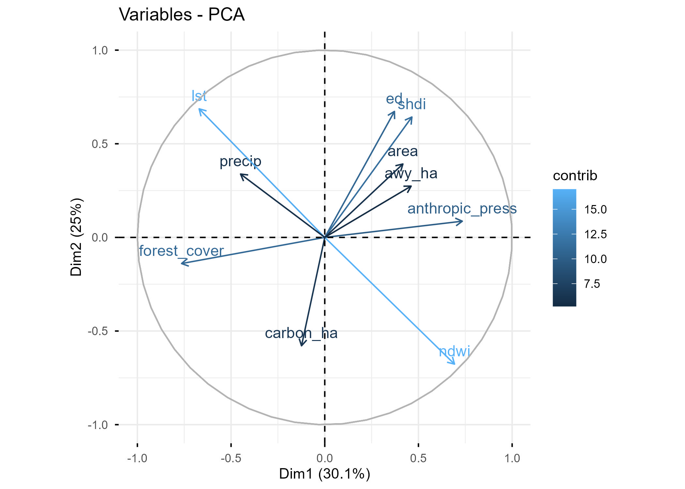
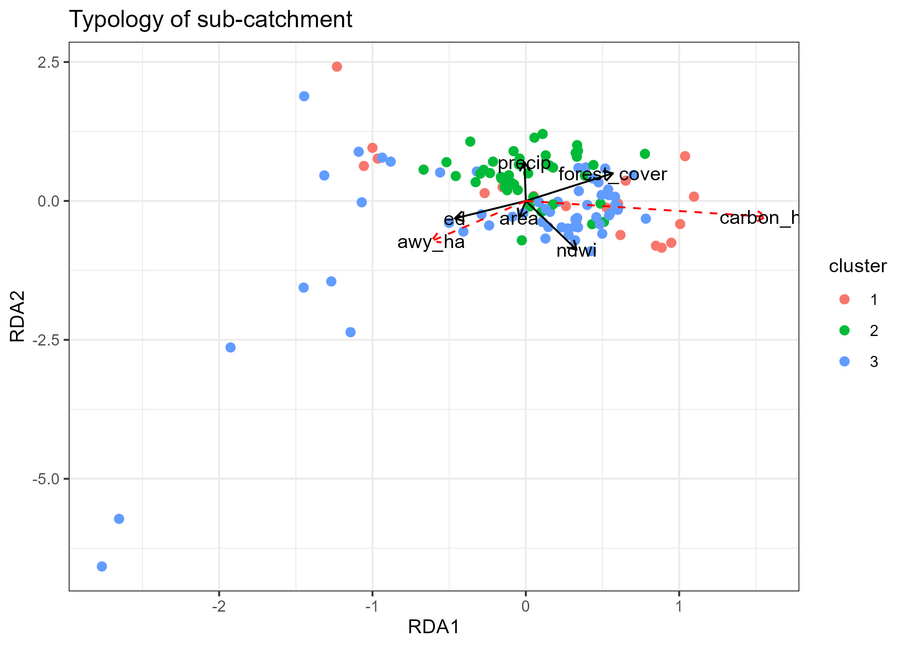

# 🧬 Multivariate Analysis of Ecosystem Services (RDA+PCA+HCPC)
 

## 📌 Overview
This exploratory project aims to map the **linear structural relationships** and **spatial typologies** of ecosystem services (Carbon & Water) in the Parakou region. By using **Redundancy Analysis (RDA)**, we identify how environmental drivers constrain the provision of services at the sub-catchment scale.

## 🛠 Methodology
* **Unit of Analysis**: 120 hydrologically delineated sub-catchments.
* **Statistical Framework**:
    * **RDA (Redundancy Analysis)**: Used to model the "response" matrix (Carbon, Runoff) as a function of the "explanatory" matrix (LULC, Climate, Landscape Metrics).
    * **PCA (Principal Component Analysis)**: Used to reduce dimensionality before clustering.
    * **HCPC (Hierarchical Clustering on Principal Components)**: Applied after PCA to define a functional typology of the territory.
* **Key Software**: `R` with the `vegan` package (for RDA) and `FactoMineR` (for HCPC).

## 📊 Exploratory Results

### 1. Redundancy Analysis (RDA)
The RDA allows us to visualize the "push and pull" of environmental factors:
* **The Carbon-Water Trade-off**: Early results show an opposition between high carbon storage (linked to `forest_cover`) and high water yield (linked to `precip` and `anthropic_press`).
* **Environmental Constraints**: The first deux axes typically explain a significant portion of the variance, revealing the "gradient" of degradation vs. conservation.

### 2. PCA: The Driving Forces
The Principal Component Analysis revealed that **72.47%** of the variance is captured by the first three dimensions. The first axis (Dim 1) clearly separates "Conservation" (Forest Cover) from "Anthropization" (Built-up and Crops).

## 🗺️ Landscape Typology & Clustering (PCA + HCPC)
A **Hierarchical Clustering on Principal Components (HCPC)** was performed on the first 3 dimensions of the PCA. This identified three distinct ecohydrological profiles in the Parakou region:

* **Cluster 1: Conservation Sanctuaries**
    * **Profile**: High `forest_cover`, minimal fragmentation (`ed`, `shdi` low), and low `anthropic_press`.
    * **Insight**: These represent the "baseline" of ecosystem services, primarily found in smaller, preserved sub-catchments.
* **Cluster 2: Fragmented Thermal Hotspots**
    * **Profile**: Highest Land Surface Temperature (`lst`) and high landscape fragmentation.
    * **Insight**: These areas show significant ecohydrological stress; the high temperature suggests a loss of the forest's cooling service.
* **Cluster 3: Anthropized Runoff Basins**
    * **Profile**: Dominant `anthropic_press`, high `ndwi` (surface water signatures), and high `awy_ha` (Runoff).
    * **Insight**: Urbanized or heavily cultivated areas where the hydrological cycle is dominated by surface runoff.

